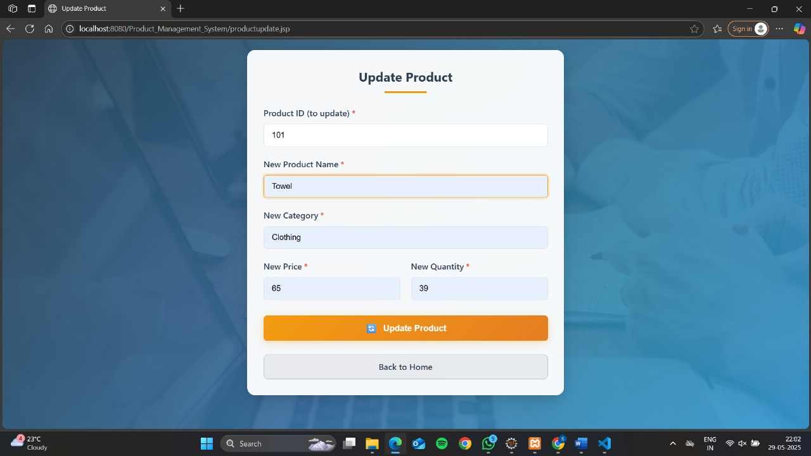
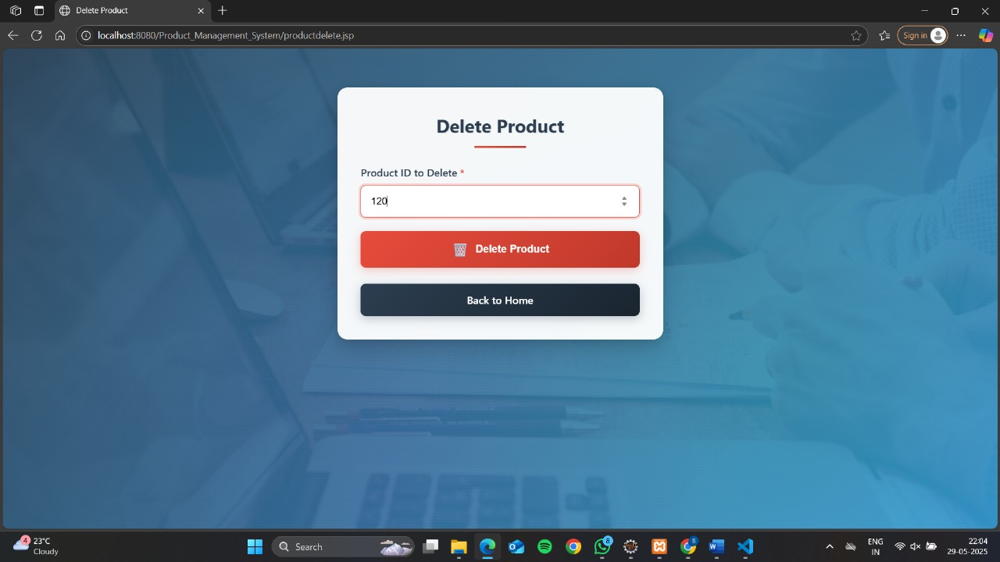

# 🛒 Product Management System

A web-based Java application to manage product inventory using JSP, Servlets, JDBC, and MySQL following the MVC architecture.

## 🚀 Features

- Add new products
- Update existing product details
- Delete obsolete products
- Display all products
- Generate reports:
  - Products with price greater than a value
  - Products by category
  - Top N products by quantity

  ## 📁 Project Structure

```ProductWebApp/
├── WebContent/
│   ├── index.jsp
│   ├── productadd.jsp
│   ├── productupdate.jsp
│   ├── productdelete.jsp
│   ├── productdisplay.jsp
│   ├── reports.jsp
│   ├── report_form.jsp
│   └── report_result.jsp
├── src/
│   ├── com/
│   ├── dao/
│   │   └── ProductDAO.java
│   ├── model/
│   │   └── Product.java
│   └── servlet/
│       ├── AddProductServlet.java
│       ├── UpdateProductServlet.java
│       ├── DeleteProductServlet.java
│       ├── DisplayProductsServlet.java
│       ├── ReportServlet.java
│       └── ReportCriteriaServlet.java
└── WEB-INF/
    └── web.xml
```


## 🗄️ Database Setup
### 1. Create Database

```sql
CREATE DATABASE IF NOT EXISTS product_management;
USE product_management;
```

### 2. Create Table

```sql
CREATE TABLE Products (
    ProductID INT PRIMARY KEY,
    ProductName VARCHAR(100),
    Category VARCHAR(50),
    Price DECIMAL(10,2),
    Quantity INT
);
```
### 3. Insert Sample Data
```sql
INSERT INTO Product (id, name, category, price, quantity) VALUES
(101, 'Smart Watch', 'Electronics', 2000.00, 25),
(102, 'Smartphone', 'Electronics', 20000.00, 15),
(103, 'Comb', 'Beauty', 30.00, 25),
(104, 'Pen', 'Stationery', 10.00, 300),
(105, 'Face wash', 'Beauty', 45.00, 12),
(106, 'Sunscreen', 'Beauty', 60.00, 65);


```


## ⚙️ Installation & Setup

### Step 1: Clone/Download the Project
Download all the project files and organize them according to the project structure above.

### Step 2: Database Configuration
1. Start your MySQL server  
2. Run the database setup scripts provided above  
3. Update database credentials in `ProductDAO.java`:

```java
connection = DriverManager.getConnection(
    "jdbc:mysql://localhost:3306/product_management", 
    "your_username", 
    "your_password");
 ```


## 🖼️ Output Screenshots

### 🏠 Home Page


### ➕ Add Product


### 📝 Update Product


### ❌ Delete Product


### 📋 Display Products


### 📊 Generate Reports


